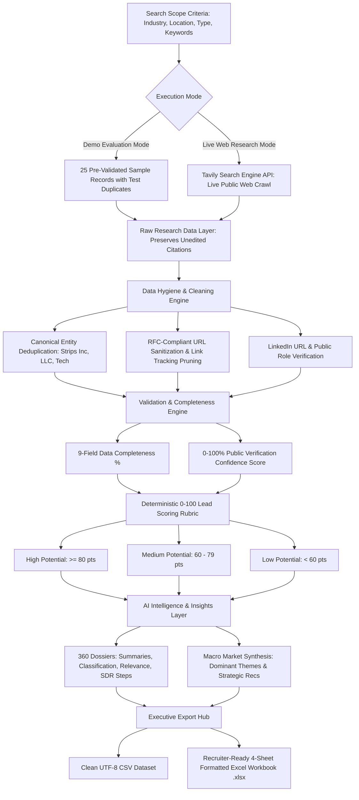

<div align="center">

# ⚡ Intellix B2B Research AI
### Autonomous B2B Web Research, Data Hygiene & 0–100 Deterministic Lead Scoring OS

[](https://python.org)
[](https://intellix-b2b-research-ai.streamlit.app/)
[](https://pandas.pydata.org)
[](https://openpyxl.readthedocs.io)
[](https://tavily.com)
[](https://github.com/ShivamkumarMantri/Intellix-B2B-Research-AI)

<p align="center">
  <strong>Intellix B2B Research AI</strong> is an enterprise-grade autonomous intelligence dashboard that searches, extracts, sanitizes, validates, scores, and exports verified B2B prospect intelligence directly from public business sources.
</p>

<p align="center">
  <a href="https://intellix-b2b-research-ai.streamlit.app/" target="_blank">
    
  </a>
</p>
<p align="center">
  🌐 <strong>Live App Link</strong>: <a href="https://intellix-b2b-research-ai.streamlit.app/" target="_blank"><strong>https://intellix-b2b-research-ai.streamlit.app/</strong></a>
</p>

</div>

---

## 🌟 Executive Summary

Traditional B2B lead generation relies on manual web searching or rigid static databases filled with stale contacts, unverified links, and duplicated records. **Intellix B2B Research AI** solves this through a modular, autonomous research and scoring pipeline:

1. **Autonomous Web Discovery**: Ingests fresh, verifiable public business evidence via Tavily Search API with 100% source link attribution.
2. **Deterministic Data Quality & Hygiene**: Canonical company deduplication (stripping legal suffixes like `Inc.`, `LLC`, `Technologies`), URL normalization, and LinkedIn profile verification.
3. **100% Deterministic 0–100 Lead Scoring**: Zero random values. Evaluates prospect fit across a transparent, reproducible 7-factor mathematical rubric.
4. **Provider-Agnostic AI Intelligence**: Generates 360° prospect dossiers and macro market synthesis using any OpenAI-compatible LLM (Groq, OpenAI, Ollama), with robust zero-key heuristic fallbacks.
5. **Interview-Ready 4-Sheet Excel Export**: Generates styled, freeze-paned executive workbooks formatted for CRM ingestion and board presentation.
6. **Zero-Configuration Demo Mode**: Ships with 25 curated realistic B2B records spanning 9 verticals and global hubs, clearly tagged as `[DEMO DATA]` for instant evaluation.

---

## 🏗️ System Architecture Pipeline



---

## 🎯 100% Deterministic 0–100 Lead Scoring Rubric

Unlike black-box or randomized lead scoring systems, Intellix calculates scores through an objective, mathematical point-allocation matrix:

| Factor | Max Weight | Allocation Criteria & Rules |
| :--- | :---: | :--- |
| **1. Industry Relevance** | **25 pts** | Direct target vertical match (**+25**), sub-vertical or keyword match (**+15**), general B2B domain match (**+5**). |
| **2. Location Match** | **20 pts** | Exact city/hub match (**+20**), regional or state match (**+12**), remote/unverified (**+0**). |
| **3. Decision-Maker Availability** | **15 pts** | Identified executive with title/role (**+15**), name only (**+8**), unverified leadership (**+0**). |
| **4. Data Completeness** | **15 pts** | Completeness $\ge 88\%$ (**+15**), $\ge 70\%$ (**+10**), $\ge 50\%$ (**+6**), $<50\%$ (**+2**). |
| **5. Website Availability** | **10 pts** | Validated, reachable domain (**+10**), invalid or missing (**+0**). |
| **6. Research Confidence** | **10 pts** | Validation confidence $\ge 80\%$ (**+10**), $\ge 60\%$ (**+6**), $<60\%$ (**+2**). |
| **7. LinkedIn Availability** | **5 pts** | Verified company/profile link (**+5**), unavailable (**+0**). |
| **Total Lead Score** | **100 pts** | **High Potential ($\ge 80$)** • **Medium Potential ($60\text{--}79$)** • **Low Potential ($<60$)** |

> Every prospect record includes a deterministic natural-language explanation detailing exactly why it received its score and points.

---

## 📊 Recruiter-Ready 4-Sheet Excel Executive Report

Built with `openpyxl`, the exported `.xlsx` workbook provides an enterprise-grade report formatted for board review, CRM ingestion, and hiring portfolio demonstrations:

| Sheet Name | Key Features & Design System |
| :--- | :--- |
| **Sheet 1: `Research Results`** | • Corporate Navy headers (`#1E293B`) with white text and bold borders<br>• Frozen panes (`C2`) keeping header and Company Name fixed during scrolling<br>• Active Excel auto-filters across all columns<br>• Soft-colored category badges (Green = High, Amber = Medium, Red = Low)<br>• Clickable hyperlinks (`#2563EB`) for Website, LinkedIn, and Source URLs |
| **Sheet 2: `Data Quality`** | • Top KPI Summary Cards (Total Ingested, Valid Entities, Duplicates Pruned, Incomplete Records, Invalid URLs, Avg Confidence %, Avg Completeness %)<br>• Record-by-record verification audit log with field hygiene notes |
| **Sheet 3: `Lead Scoring`** | • Complete 7-Factor Scoring Weights Rubric Table (Sum = 100 Pts)<br>• Detailed company-by-company factor point breakdown table<br>• Frozen panes (`D14`) and transparent mathematical explanations |
| **Sheet 4: `Research Summary`** | • Executive title banner and search scope manifest<br>• Cohort aggregate metrics (Lead counts by tier, Average lead fit)<br>• **⭐ Top 5 Priority ICP Opportunities Spotlight** ranked with key decision makers |

---

## 🤖 360° AI Intelligence Engine

Supports any OpenAI-compatible provider (Groq, OpenAI, Together AI, Ollama) and automatically activates built-in heuristic synthesizers when running offline or without keys:

1. **📝 Company Summary**: Generates 2–3 sentence executive profiles highlighting core value propositions and customer positioning.
2. **🏷️ Industry Classification**: Classifies entities into standardized taxonomies (primary industry, sub-vertical, and business model).
3. **🎯 Business Relevance Analysis**: Evaluates ICP fit, identifies probable business pain points, and drafts personalized outreach hooks.
4. **🛡️ Lead-Quality Explanation**: Audits data completeness and recommends concrete next steps for SDRs and recruiters.
5. **🔍 Key Information Extraction**: Pulls structured corporate entities, technical signals, company scale tiers, and key contacts.
6. **📊 Portfolio Market Insights**: Synthesizes macro trends, dominant technology patterns, and strategic positioning opportunities across the entire lead cohort.

---

## 🧪 Curated 25-Record Demo Evaluation Dataset

When no API keys are configured, the application runs a realistic end-to-end evaluation using a 25-company dataset:
- **9 Diverse Verticals**: Artificial Intelligence, FinTech, B2B SaaS, HealthTech, CyberSecurity, Supply Chain Tech, Data Analytics, CleanTech, EdTech.
- **Global & Domestic Tech Hubs**: Mumbai, Pune, Bengaluru, Chennai, Hyderabad, Delhi NCR, Singapore, San Francisco, London.
- **Intentional Test Duplicates**: Contains 3 deliberate duplicates (`NovaByte AI`, `DataOrbit Technologies Inc.`, `CyberShield Defense`) to visibly prove canonical deduplication and corporate suffix pruning in action.
- **Ethical Labeling**: Every demo record is explicitly tagged with `'Data Source': '[DEMO DATA]'` and displayed with evaluation banners.

---

## 🚀 Quick Start Guide

### Prerequisites
- Python 3.10, 3.11, or 3.12
- Git

### 1. Clone & Set Up
```bash
# Clone the repository
git clone https://github.com/ShivamkumarMantri/Intellix-B2B-Research-AI.git
cd Intellix-B2B-Research-AI

# Create virtual environment
python -m venv .venv

# Activate virtual environment
# Windows:
.venv\Scripts\activate
# macOS/Linux:
source .venv/bin/activate

# Install dependencies
pip install -r requirements.txt
```

### 2. Configure Environment (Optional)
```bash
cp .env.example .env
```
Edit `.env` if you want to use live search or external LLMs:
```env
# Optional: Live web search (Get free key at https://tavily.com)
TAVILY_API_KEY=your_tavily_key

# Optional: LLM provider (Groq free tier or OpenAI)
LLM_API_KEY=your_llm_key
LLM_BASE_URL=https://api.groq.com/openai/v1
LLM_MODEL=llama-3.3-70b-versatile
```
> **Note**: Both keys are completely optional. The app runs 100% offline in Demo Mode with zero configuration.

### 3. Launch the Dashboard
```bash
streamlit run app.py
```
Open **[http://localhost:8501](http://localhost:8501)** in your browser.

### 4. Run Automated Production-Readiness Tests
```bash
python scratch/test_production_readiness.py
```
Executes 9 unit tests verifying deduplication, URL validation, lead scoring determinism, AI synthesizers, and 4-sheet Excel generation.

### ☁️ Streamlit Community Cloud Deployment
The application is live in production on Streamlit Community Cloud:  
👉 **[https://intellix-b2b-research-ai.streamlit.app/](https://intellix-b2b-research-ai.streamlit.app/)**

Deploying or updating on **Streamlit Community Cloud** takes under 2 minutes:
1. Log in to [share.streamlit.io](https://share.streamlit.io) with your GitHub account.
2. Click **New app** and select:
   - **Repository**: `ShivamkumarMantri/Intellix-B2B-Research-AI`
   - **Branch**: `main`
   - **Main file path**: `app.py`
3. *(Optional)* In **Advanced settings ➔ Secrets**, paste your API credentials (see template in [`.streamlit/secrets.toml.example`](.streamlit/secrets.toml.example)):
   ```toml
   TAVILY_API_KEY = "tvly-..."
   LLM_API_KEY = "gsk_..."
   LLM_BASE_URL = "https://api.groq.com/openai/v1"
   LLM_MODEL = "llama-3.3-70b-versatile"
   ```
4. Click **Deploy!** The application will launch with full Demo Mode and Live Research capabilities.

---

## 📂 Repository Structure

```
Intellix-B2B-Research-AI/
├── app.py                      # Main Streamlit dashboard & pipeline controller
├── requirements.txt            # Production dependencies
├── .env.example                # Template for optional API credentials
├── .gitignore                  # Git ignore rules (secrets & temp files protected)
├── README.md                   # Comprehensive architecture & evaluation guide
├── utils/
│   ├── ai.py                   # 6 AI synthesizers, OpenAI client, & fallbacks
│   ├── exporter.py             # Recruiter-ready 4-sheet Excel (.xlsx) & CSV exporter
│   ├── research.py             # Tavily live crawler & 25-record demo dataset
│   └── validation.py           # Canonical deduplication, sanitization, & 0-100 scoring
└── scratch/
    ├── test_production_readiness.py # Complete 9-part automated test suite
    └── test_excel_export.py         # Dedicated 4-sheet Excel export validator
```

---

## 💼 Resume & Portfolio Description

```
Intellix B2B Research AI | Python, Streamlit, Pandas, openpyxl, Tavily API, LLM
• Architected an autonomous B2B research engine that discovers, cleans, and scores commercial leads from public web sources.
• Engineered a data hygiene pipeline with canonical deduplication (stripping corporate suffixes & normalizing domains), URL sanitization, and data completeness auditing.
• Designed a 100% deterministic 7-factor 0–100 Lead Scoring rubric with category tiers (High/Medium/Low Potential) and mathematical explanations.
• Integrated OpenAI-compatible LLMs (Groq / Llama 3.3) for 360° prospect dossiers with zero-key heuristic fallbacks for offline demo evaluation.
• Implemented an executive 4-sheet openpyxl Excel export engine featuring frozen panes, auto-filters, category styling, and Top 5 ICP opportunity spotlights.
```

---

<div align="center">
  <sub>Developed with passion for modern data engineering and autonomous AI intelligence.</sub>
</div>
